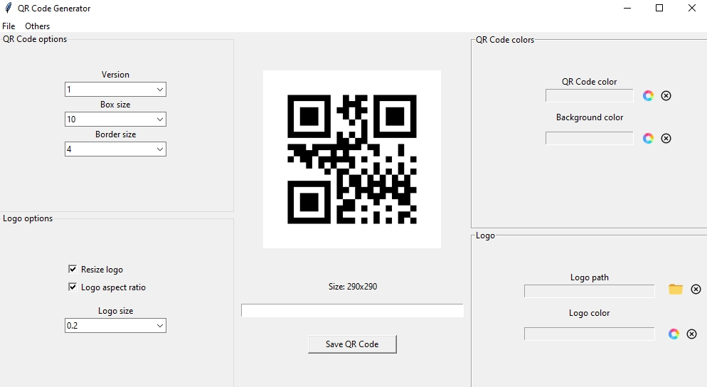

# 🎯 Gerador de QR Code Customizado


Uma ferramenta desktop robusta desenvolvida em **Python** que permite a criação de QR Codes profissionais. Diferente de geradores comuns, este projeto foca na **identidade visual**, permitindo a inclusão de logos e personalização completa de cores.

## 📸 Demonstração



## ✨ Funcionalidades

- [x] **Versatilidade:** Gere QR Codes de URLs, textos, Wi-Fi ou contatos.
- [x] **Branding:** Insira sua logo centralizada com redimensionamento automático para não quebrar a leitura.
- [x] **Estilização:** Controle total sobre a cor do código (Foreground) e do fundo (Background).
- [x] **Alta Resolução:** Exportação disponível em formatos raster (**PNG, JPG**) e vetorial (**SVG**).
- [x] **Preview:** Visualize o resultado em tempo real antes de salvar.

## 🛠️ Tecnologias Utilizadas

O projeto foi construído utilizando as seguintes bibliotecas:

* **[Python](https://www.python.org/):** Linguagem base.
* **[Tkinter](https://docs.python.org/3/library/tkinter.html):** Para a interface gráfica (GUI).
* **[Library qrcode](https://pypi.org/project/qrcode/):** Motor de geração dos códigos.
* **[Pillow (PIL)](https://python-pillow.org/):** Processamento e manipulação de imagens e logos.

## 🧠 Desafio Técnico: Processamento em Lote (Bulk Generation)

O ponto mais desafiador e gratificante deste projeto foi a implementação do **Gerador Múltiplo**. Diferente de geradores simples, este módulo exigiu uma lógica de programação mais apurada para:

1. **Automação de Fluxo:** Criar um sistema que itera sobre listas de dados sem interromper a execução da interface.
2. **Consistência de Design:** Garantir que as regras de redimensionamento de logo e paleta de cores fossem aplicadas identicamente a todos os arquivos do lote.
3. **Gestão de Arquivos:** Implementar um tratamento de erros para evitar conflitos de nomes e garantir que cada arquivo fosse salvo corretamente no diretório de destino.

## 🚀 Como Executar o Projeto

### Pré-requisitos
Você precisará ter o **Python 3.x** instalado em sua máquina.

### Instalação

1. Clone o repositório:
```bash
git clone [https://github.com/gustavohen27/qr-code-generator.git](https://github.com/gustavohen27/qr-code-generator.git)

## 📄 Licença & Copyright

> **Copyright © 2026 Gustavo Henrique.**
> 
> Todos os direitos reservados. Este software foi desenvolvido como parte de um portfólio profissional. O código-fonte está disponível apenas para fins de visualização e estudo técnico.
> 
> **Não é permitida a redistribuição, venda ou uso comercial sem autorização prévia.** Para propostas ou licenciamento, entre em contato via [LinkedIn](https://www.linkedin.com/in/gustavohen27/).
